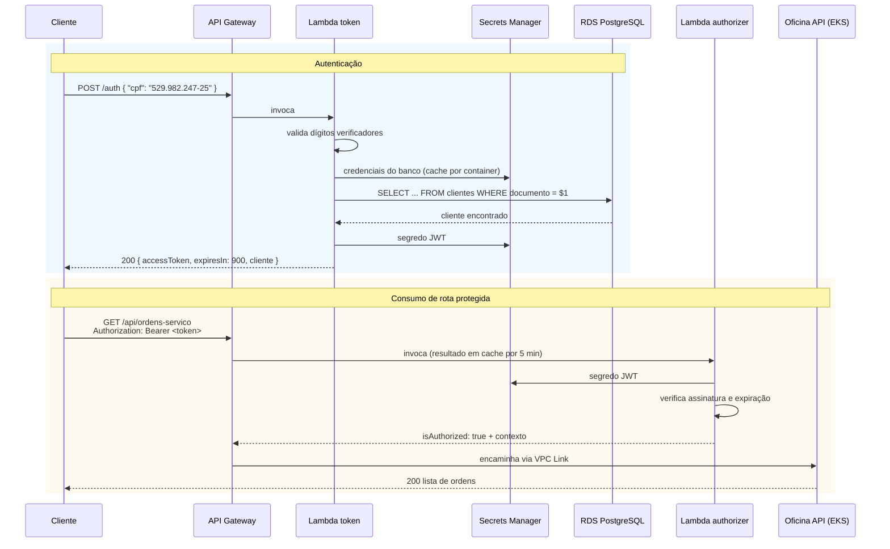

# oficina-lambda-auth

**Function serverless de autenticação por CPF** da Oficina API — Tech Challenge SOAT, Fase 3.

Duas funções Lambda que, juntas, entregam o requisito de autenticação sem servidor:

| Função | Papel |
| --- | --- |
| **`oficina-auth-token`** | Valida o CPF, consulta a existência e a situação do cliente na base e emite um JWT |
| **`oficina-auth-authorizer`** | Valida o JWT nas rotas protegidas do API Gateway |

## Tecnologias

- **Node.js 20** + **TypeScript** (strict)
- **esbuild** para empacotamento — artefatos de 19 KB e 45 KB
- **jsonwebtoken** (HS256) · **pg** para consulta ao RDS
- **AWS Secrets Manager** para o segredo de assinatura e as credenciais do banco
- **Jest** — 26 testes
- **Terraform** + **GitHub Actions**

## Arquitetura



## Decisões de projeto

**Duas funções, não uma.** O authorizer é invocado em **toda** requisição protegida; a emissão de token, apenas no login. Separá-los mantém o authorizer fora da VPC e sem o driver do PostgreSQL — 19 KB contra 45 KB — o que reduz o cold start no caminho crítico.

**O authorizer não acessa a VPC.** Ele só verifica assinatura e expiração, então não precisa alcançar o RDS. Ficar fora da VPC elimina a criação de ENI, que é a maior fonte de latência de cold start em Lambdas com `vpc_config`.

**Authorizer `REQUEST`, não `JWT` nativo.** O authorizer JWT do API Gateway exige um emissor **OIDC** com JWKS público. O token é assinado em HS256 com segredo compartilhado, então a validação é feita em código, com `authorizer_result_ttl_in_seconds = 300` para amortizar o custo.

**O segredo de assinatura é compartilhado com a aplicação principal.** O JWT emitido aqui precisa ser aceito também pelos guards do NestJS no cluster. O segredo é gerado por este repositório, publicado no Secrets Manager em `oficina/auth/jwt` e lido pelo `oficina-api`.

**Validação de CPF duplicada de propósito.** A regra é idêntica à de `src/shared/validators/cpf-cnpj.validator.ts` na aplicação. Importar o pacote da aplicação traria o NestJS inteiro para dentro do bundle e inflaria o cold start. A duplicação é o preço, consciente, de manter a função autocontida — e está coberta por testes nos dois lados.

**`LabRole` como role de execução.** O AWS Academy não concede `iam:CreateRole`. A role já provisionada pelo laboratório é referenciada por `data`.

**Conexão e segredo em cache por container.** O `Pool` do `pg` e o resultado do Secrets Manager vivem fora do handler, sendo reaproveitados enquanto o container estiver quente. O pool é limitado a `max: 1` para não esgotar o limite de conexões do RDS sob concorrência.

## API

### `POST /auth`

```bash
curl -X POST "$API_GATEWAY_URL/auth" \
  -H 'content-type: application/json' \
  -d '{"cpf": "529.982.247-25"}'
```

**200**
```json
{
  "accessToken": "eyJhbGciOiJIUzI1NiIs...",
  "expiresIn": 900,
  "cliente": { "id": "3f2a...", "nome": "Maria Souza" }
}
```

| Status | Código | Quando |
| --- | --- | --- |
| `400` | `CPF_INVALIDO` | CPF ausente, malformado ou com dígito verificador incorreto |
| `404` | `CLIENTE_NAO_ENCONTRADO` | CPF válido, mas sem cadastro na base |
| `500` | `ERRO_INTERNO` | Falha ao consultar o banco ou o Secrets Manager |

Toda resposta traz o cabeçalho `x-correlation-id`, que corresponde ao `requestId` do API Gateway e aparece em todas as linhas de log.

### Usando o token

```bash
curl "$API_GATEWAY_URL/api/ordens-servico" \
  -H "Authorization: Bearer $TOKEN"
```

## Observabilidade

Todo log sai em **JSON estruturado** no CloudWatch:

```json
{
  "timestamp": "2026-09-15T22:37:13.761Z",
  "nivel": "info",
  "servico": "oficina-lambda-auth",
  "mensagem": "token emitido",
  "requestId": "req-abc123",
  "clienteId": "3f2a...",
  "duracaoMs": 84
}
```

O CPF **nunca** é registrado por inteiro — a função `mascararCpf` reduz para `529.***.**25`.

## Execução

### Pré-requisitos

- Node 22, pnpm 10, Terraform `>= 1.9`
- O repositório [`oficina-infra-database`](https://github.com/fdacmatheus/oficina-infra-database) **já aplicado**

### Testes

```bash
pnpm install
pnpm test           # 26 testes
pnpm test:cov       # cobertura, mínimo 80% de linhas
pnpm typecheck
```

### Deploy

```bash
pnpm package        # gera build/token.zip e build/authorizer.zip

cd infra
terraform init
terraform apply
```

### Conectar ao API Gateway

Depois do apply, informe os ARNs ao repositório `oficina-infra-k8s`:

```bash
cd infra
terraform output -raw token_function_arn
terraform output -raw authorizer_function_arn
```

```bash
# no repositório oficina-infra-k8s
terraform apply \
  -var="lambda_token_arn=arn:aws:lambda:us-east-1:679445922616:function:oficina-auth-token" \
  -var="lambda_authorizer_arn=arn:aws:lambda:us-east-1:679445922616:function:oficina-auth-authorizer"
```

### Testar localmente contra a AWS

```bash
aws lambda invoke --function-name oficina-auth-token \
  --cli-binary-format raw-in-base64-out \
  --payload '{"body":"{\"cpf\":\"529.982.247-25\"}","requestContext":{"requestId":"local"}}' \
  /dev/stdout
```

### Destruir

```bash
cd infra && terraform destroy
```

## Estrutura

```
src/
├── domain/                    regra pura, sem dependência de AWS
│   ├── cpf.ts                 validação, formatação e máscara
│   └── erros.ts               erros de domínio com código estável
├── infrastructure/
│   ├── segredos.ts            Secrets Manager com cache por container
│   ├── clientes.repository.ts consulta ao RDS
│   └── log.ts                 log estruturado em JSON
└── handlers/
    ├── token.ts               POST /auth
    └── authorizer.ts          authorizer do API Gateway
```

## Outputs do Terraform

| Output | Consumido por |
| --- | --- |
| `token_function_arn` | `oficina-infra-k8s` (`lambda_token_arn`) |
| `authorizer_function_arn` | `oficina-infra-k8s` (`lambda_authorizer_arn`) |
| `jwt_secret_arn` | `oficina-api`, para validar o mesmo token |
| `jwt_secret_name` | `oficina-api` |

## CI/CD

[`.github/workflows/ci-cd.yml`](.github/workflows/ci-cd.yml)

| Gatilho | Ação |
| --- | --- |
| Pull Request | Typecheck + testes com cobertura + empacotamento + `terraform validate` |
| Push em `homolog` | Deploy em homologação |
| Push em `main` | Deploy em produção + smoke test do authorizer |
| `workflow_dispatch` com `destroy` | Remove as funções |

O smoke test invoca o authorizer com um token inválido e falha o pipeline se a resposta não for `isAuthorized: false` — uma regressão nessa verificação abriria todas as rotas protegidas.

**Secrets necessários**: `AWS_ACCESS_KEY_ID`, `AWS_SECRET_ACCESS_KEY`, `AWS_SESSION_TOKEN`.

## Repositórios relacionados

| Repositório | Papel |
| --- | --- |
| [`oficina-api`](https://github.com/fdacmatheus/oficina-api) | Aplicação principal em Kubernetes |
| [`oficina-infra-k8s`](https://github.com/fdacmatheus/oficina-infra-k8s) | Cluster EKS, API Gateway e observabilidade |
| [`oficina-infra-database`](https://github.com/fdacmatheus/oficina-infra-database) | RDS PostgreSQL gerenciado |
